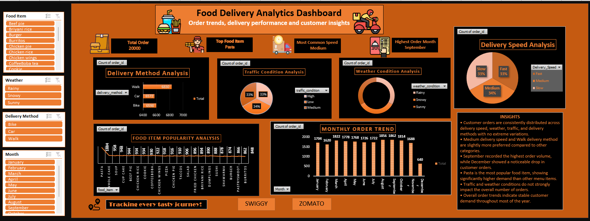

# Food-Order-Dashboard
## Overview
This project is an interactive Excel dashboard developed to analyze food order data and delivery performance.

## Features
- Order Analysis
- Revenue Tracking
- Delivery Speed Analysis
- Delivery Method Analysis
- Customer Insights
- Interactive Slicers

## Tools Used
- Microsoft Excel
- Pivot Tables
- Pivot Charts
- Data Model
- Slicers
- Conditional Formatting

## Dashboard Preview

## Key Insights
- Medium delivery speed recorded the highest number of orders.
- Walk delivery was the most preferred delivery method.
- Orders were distributed fairly evenly across delivery categories.
